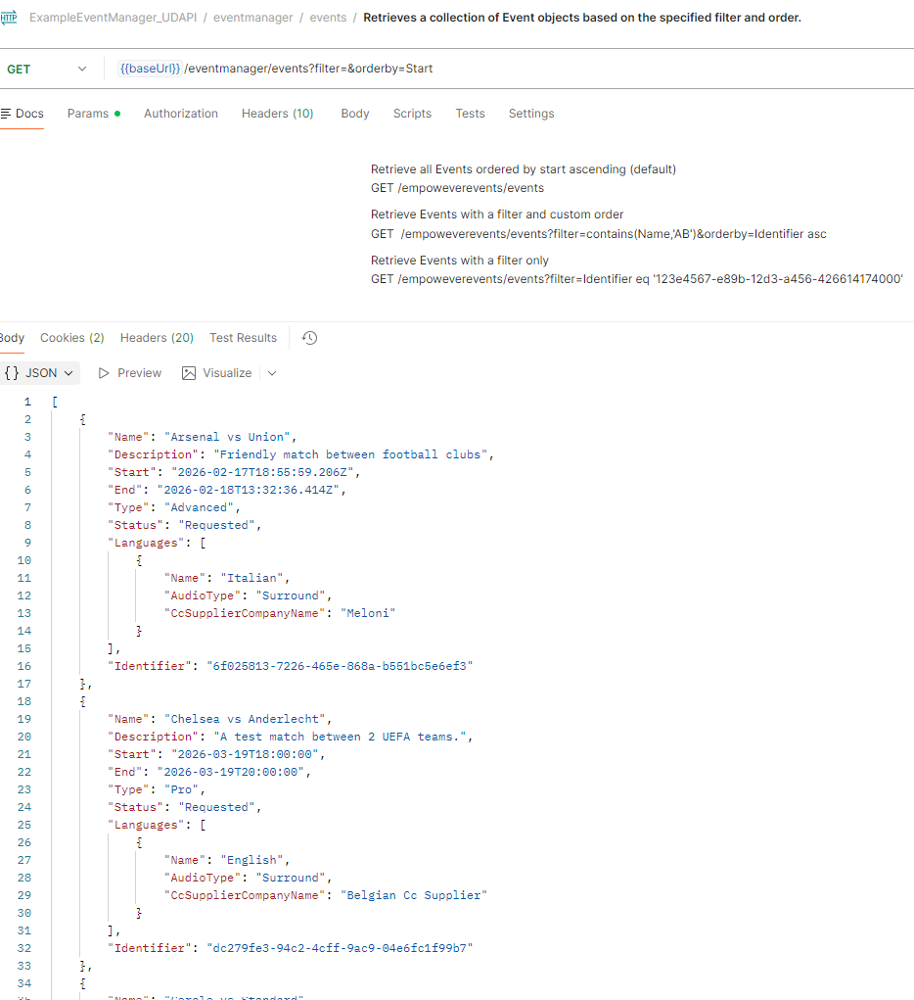
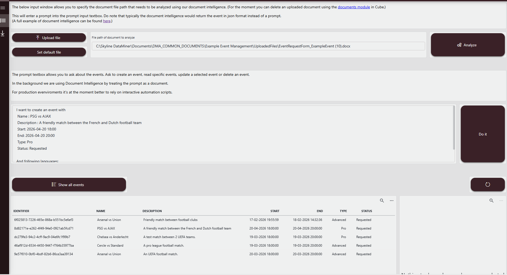
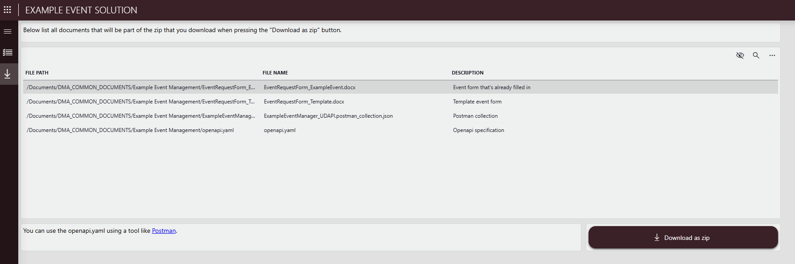

# Example Event Manager

The Example Event Manager is a sample application that demonstrates what you can create using the [events backend](https://catalog.dataminer.services/details/7c402377-ce88-479f-a249-5c086b5d84bd) and the [C# Nuget](https://www.nuget.org/packages/Skyline.DataMiner.Learning.EventManagement/).
This backend is build using the Standard Data Model principles.

It allows the following:

✅ **Creating dashboards and low code apps**: Using the provided ad hoc data sources.  
✅ **Integrate with 3rd parties**: Using the included webapi.  
✅ **Integrate with PowerBI**: Using the included webapi.  
✅ **Leverage Document Intelligence**: Allow to analyze a word document and create an event out of it.  
✅ **Example of including prompts**: A showcase on how you can leverage the backend to allow a LLM to process prompts specific to events. .

## Ad hoc data sources

Allowing to create dashboards and Low code apps to retrieve the events and the languages of each event.

## User defined API

After configuring the script "ExampleEventManager_UDAPI" with a bearer token.

This bearer token can be configured via Cube or you can used the installed Low Code app to configure the bearer token via the downloads page.
On that downloads page you can also download the openapi spec or postman collection.

You can retrieve the info via a webapi.

## Example low code app

### Events page

This page allows you to upload a document and analyze it to create an event.

You can as well enter a prompt to filter out events, create a new event or edit/delete a selected event from the events table.

### Downloads page

This page allows you to download the event example input form and also an openapi spec and postman collection. Next to that you can configure

## How to Use

### Prerequisites

- [Standard Data Model Registration](https://catalog.dataminer.services/details/52173e49-9185-4772-9b60-c186ee365a81)
- [Example Event Manager Backend](https://catalog.dataminer.services/details/7c402377-ce88-479f-a249-5c086b5d84bd)

